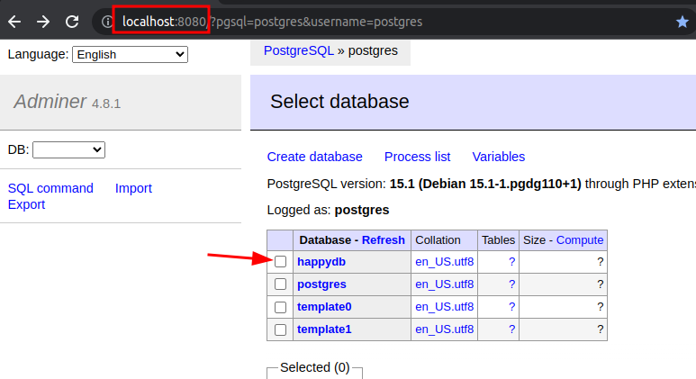
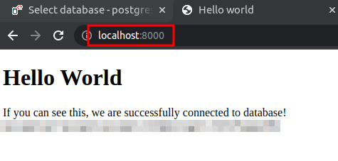

# Flask + Postgres Sample App

## Prerequisites

- Docker
- Docker compose

## Bring up

Run 

```bash
$   docker compose up -d
```

First time you run this, it will build the app.

And it will launch the following components

* Postgres database
* adminer UI - listening on [localhost:8080](http://localhost:8080)
* Web app - listening on [localhost:8000](http://localhost:8000)



## Test-1: Check DB Connection

Log into adminer UI running on [localhost:8080](http://localhost:8080)

* username: `postgres`
* password: `postgres123`

Once you login you will see `happydb`.

If this works, postgres and adminer are working together.

## Test-2: Check Web app

Go to webapp running at [localhost:8000](http://localhost:8000)

You should see a **Hello world** image as follows



**Congratulations! 👏**